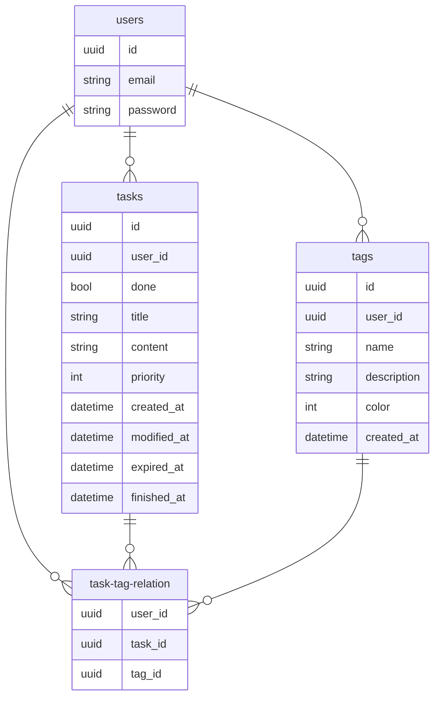

# Task Manager

## リモート

[こちら](https://sheat-git.github.io/task-manager)のGithub Pagesで公開しています。

## ローカル

### supabase

supabaseを使用しているので、supabase cliが必要です。  
Supabase CLIの[README](https://github.com/supabase/cli/blob/main/README.md)を参照してインストールしてください。

### 起動

以下のコマンドを順に実行してください。

```bash
supabase start
supabase status -o env --override-name api.url=REACT_APP_SUPABASE_URL --override-name auth.anon_key=REACT_APP_SUPABASE_ANON_KEY > .env
supabase functions serve deleteUser &
supabase functions serve updateUserEmail &
npm install & npm start
```

## レポート

Webプログラミング期末レポートより一部抜粋

### 2-1. 実装

#### S-1.1

##### データベース

BaaSの[Supabase](https://supabase.com/)を用いた。内部のデータベースはPostgreSQLであり、関係データベースの要件を満たしている。

<p class='page'>

##### タスクオブジェクト

typeの最後に`?`のついているものはオプショナル型であることを意味する。

| key | type | value |
| - | - | - |
| `id` | `uuid` | タスクの識別子 |
| `user_id` | `uuid` | 所有ユーザーの識別子 |
| `done` | `bool` | 完了か否か |
| `title` | `string` | タイトル |
| `content` | `string` | 内容（詳細） |
| `priority` | `int` | 優先度 |
| `created_at` | `datetime` | 作成日時 |
| `modified_at` | `datetime` | 最終更新日時 |
| `expired_at` | `datetime?` | 期限日時 |
| `finished_at` | `datetime?` | 完了日時 |

#### S-1.2

リスト左上の「Filters」を用いてフィルタリングが可能。  
全項目でフィルタリングが行える。

| 「完了済」が`true` | 「作成」が`2022/11/29 17:00`以降 |
| - | - |
|  |  |

#### S-1.3

Supabaseを用いたことで仕様を達成。  
Supabaseではアカウント名による登録がなかったため、メールアドレスによる登録を用いている。アカウント名での登録の際は、内部でメールアドレス形式に変換して登録。  
Row Level Securityを有効にしているので、タスクは所有ユーザーのみしかアクセスも編集もできない。

<p class='page'>

#### S-1.4

Supabaseでクライアント側からメールアドレスの変更やアカウントの削除をする際は、メールを通した確認作業が必須だが、サーバー側でEdge Functionsの機能を用いて行うことにより解決。  
メールアドレスの変更には[updateUserEmail](https://github.com/sheat-git/task-manager/tree/main/supabase/functions/updateUserEmail)、アカウントの削除には[deleteUser](https://github.com/sheat-git/task-manager/tree/main/supabase/functions/deleteUser)を当てている。  
なお、パスワードの変更はクライアント側からでもメールを通した確認作業が不要だったため、クライアント側から行なっている。

#### S-2.1

優先度や期限に応じたフィルタリングやソートは利用できる。

#### S-2.2

タグへ取り組もうとしたため、オブジェクトの設計は行い、テーブルの作成は行ったが、フロント実装までは至っていない。

##### タグオブジェクト

| key | type | value |
| - | - | - |
| `id` | `uuid` | タグの識別子 |
| `user_id` | `uuid` | 所有ユーザーの識別子 |
| `name` | `string` | 名前 |
| `description` | `string` | 説明 |
| `color` | `int` | 色コード |
| `created_at` | `datetime` | 作成日時 |

#### S-2.3

[DataGrid](https://mui.com/x/react-data-grid/)を用いて実装した。  
フィルタリング、ソートに関してもサーバーサイドで行っている。

<p class='page'>

#### S-2.5

##### ソート

リストのヘッダーの項目名をクリックすることでソートが可能。  
フィルターリングと同様、全項目で行える。

| タイトル昇順 | 優先度降順 |
| - | - |
|  |  |

### 2-2. シーケンス図

#### タスク編集


#### タスク検索


#### ログイン


### 2-3. データベース

task-tag-relationはtasksとtagsを多対多のリレーションにするためのものである。

